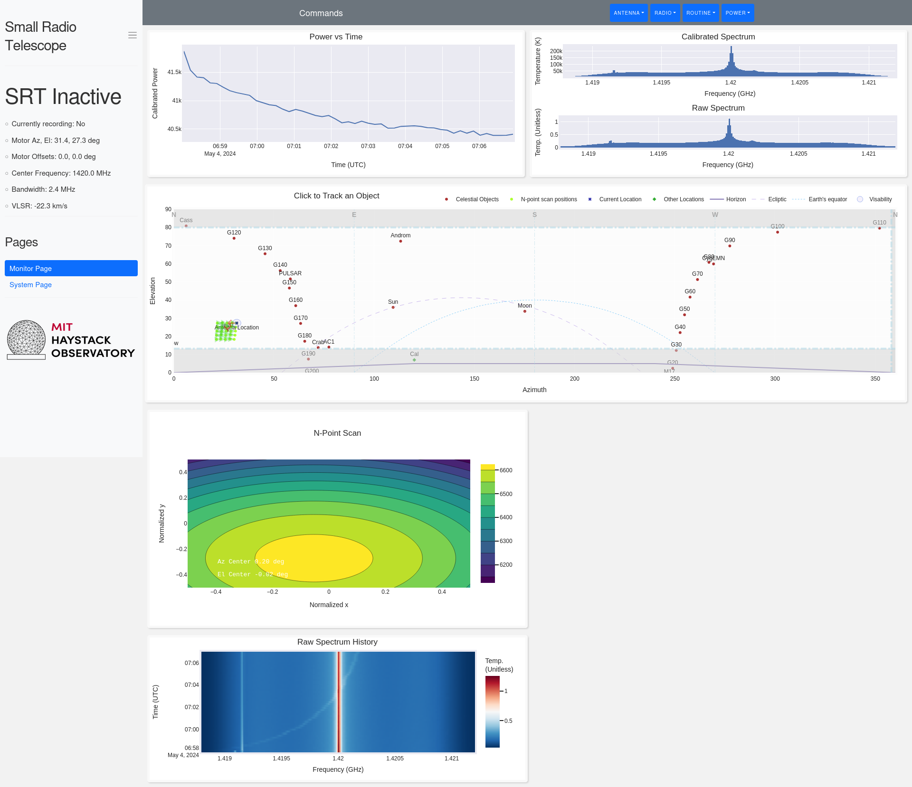
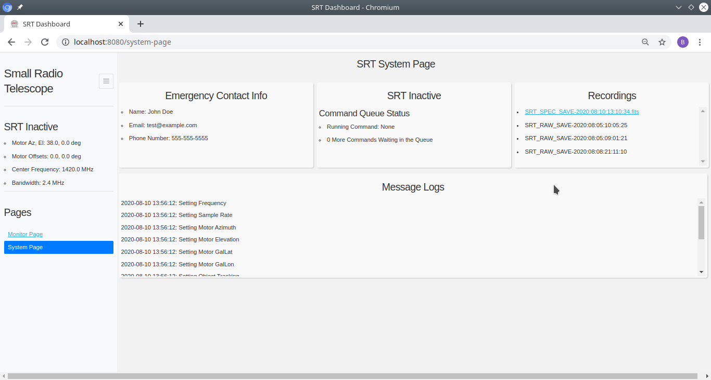

# Tufts SRT-Py

This repository is a fork of the SRT-Py framework developed by MIT Haystack Observatory for Tufts University's Small Radio Telescope (SRT).

## Description

A Python port of Haystack Observatory's Small Radio Telescope control software.

## Features

 * A New Dash-based Webpage UI for Operating the SRT Remotely
 * GNU Radio Flowgraphs Controlling the Signal Processing
 * Capable of Saving Raw I/Q Samples or Spectrum Data

### Prerequisites

This software is written in pure Python, and so depends on having an installed version of Python 3.6 or newer (although previous versions of Python 3 could be made compatible with only minor tweaks).  For your system, installation instructions for just Python can be found [here](https://www.python.org/downloads/), but it is recommended to instead install [Anaconda](https://docs.anaconda.com/anaconda/install/) or [Miniconda](https://docs.conda.io/en/latest/miniconda.html) Python in order to take advantage of their dependency management.

## Installation

### Building the Conda Package Locally

After downloading the srt-py source repository, open up a command prompt or terminal with conda installed and navigate to the folder containing the srt-py directory.  Additionally, ensure that you have conda-build and conda-verify installed

```
conda install conda-build conda-verify
```

Build and install the conda package

```
conda-build srt-py
conda install -c file://${CONDA_PREFIX}/conda-bld/ srt-py
```

### Building the Pip Package Locally (Not Recommended due to Dependency Issues)

After downloading the srt-py source repository, open up a command prompt or terminal with conda installed and navigate to the srt-py directory.  Additionally, it will be necessary to manually install some dependencies, which are specified below, that are not available through PyPI.  If these are not installed, then the following steps will throw an error with the missing dependencies.

Build and install the pip package

 ```
 pip install .
 ```

## Getting Started

Before using the software, you must create a "config" directory, which should follow the convention set by the example config directory in this repository.  Be sure to change the settings to best match your hardware, celestial objects of interest, and use case.  Please refer to the docs for more information.

Once installed, you can start the SRT Daemon and SRT Dashboard by running by executing (for the default runtime options):

```
srt_runner.py --config_dir=PATH_TO_CONFIG_DIR
```

If instead running without installing, you can start the SRT Daemon and SRT Dashboard by running by executing while in the srt-py directory:

```
conda develop .
python bin/srt_runner.py --config_dir=PATH_TO_CONFIG_DIR
```

For all commands in following sections which assume installation, modifying those commands analogously will also allow you to run them from source directly, which make custom modifications and debugging much easier.

Note: This requires manually making sure you have all the dependencies listed in Required Libraries

### OS-Specific Setup

#### Windows

On Windows, using a certain radio typically requires that one install a Windows specific driver in addition to the steps above.  For RTL-SDRs, like the one used for local testing during the development of this software, instructions for installing the driver using [Zagid](https://github.com/pbatard/libwdi/releases) can be found [here](https://www.rtl-sdr.com/rtl-sdr-quick-start-guide/), where only following steps 8-11 should be necessary.

## Example Usage

Determining whether the dashboard will automatically open up is determined by the "RUN_HEADLESS" parameter in its YAML config file.  When the software runs with its dashboard, operating via command line still remains available.

### Operating via the Dashboard

The dashboard is accessed through a web browser, on a port specified in the YAML config file.

Both of the two pages of the dashboard have a collapsible sidebar on the left side, which contains two different sections.  One section gives a brief overview of the current status of the SRT, including whether it's running a command and its position.  The other contains the links for switching between the Monitor and System pages.

#### Monitoring Page UI



The bar at the top of the dashboard manages sending commands to the SRT, which are organized into categories:

- Antenna
  - Stow
  - Set AzEl
  - Set Offsets
- Radio
  - Set Frequency
  - Set Bandwidth
- Routine
  - Start Recording
  - Stop Recording
  - Calibrate
  - Upload CMD File
- Power
  - Start Daemon
  - Shutdown

Additionally, there are four different interactive graphs displayed on this screen.
The 'Power vs Time' graph displays the received power over a certain range of time into the past.
The first of the two spectrum graphs, 'Raw Spectrum', shows the processed and integrated radio FFT data, whose values don't necessarily have any real world units and have a shape that is influenced by the band-pass filter.  The other, 'Calibrated Spectrum' shows the values after dividing out the calibration values taken when the 'Calibrate' command was last run on a test source of known temperature (such as a clump of trees or a noise diode).
Finally, there is the Azimuth-Elevation graph, which shows the current position of all objects specified to be tracked in the sky_coords.csv configuration file, as well as the reachable limits of the motor and the horizon.  Clicking on a point allows you to send a command to track that object, perform an n-point scan about the object, or repeatedly move the antenna across it.

#### System Page UI



The System Page contains many displays of information not necessary for actively controlling the SRT.  In case of a serious problem occuring when operating the SRT, there is a section for Emergency Contact Info.  There is similarly a 'Message Logs' scrolling area for logs sent from the SRT, in order to assist in debugging or just determining what it has done recently.  In the middle is a more verbose status blurb about the status of the SRT's command queue, including the number of commands queued up and what the SRT is currently trying to run.  Finally, there is also a list of the files and folders in the SRT's specified recording save directory, which users can directly download files from via the dashboard if the "DASHBOARD_DOWNLOADS" setting in the configuration YAML is set to Yes.

### Running Headless / Command Line Usage

The script 'srt_controller.py' allows for running individual commands, entire command files, and viewing the current SRT status JSON.  More information on the available commands can be found in the documentation.

#### Sending a Command

```
srt_controller.py command record test.fits
```

```
srt_controller.py command stow
```

#### Sending a Command file

```
srt_controller.py command_file examples/example_cmd_file.txt
```

#### Viewing Status

```
srt_controller.py status
```

```
srt_controller.py status --status_parameter=motor_azel
```

## Required Libraries

- python >=3.6
- numpy
- scipy
- rtl-sdr
- soapysdr
- soapysdr-module-rtlsdr
- gnuradio-core
- gnuradio-zeromq
- gnuradio-osmosdr
- digital_rf
- pyzmq
- pyserial
- astropy
- yamale
- dash
- dash-bootstrap-components
- plotly
- pandas
- waitress

## Accommodating Different Hardware

This software was most heavily tested with a RTL-SDR and a SPID Azimuth-Elevation mount, but the current software should be able to support any SDR that is supported by [SoapySDR](https://github.com/pothosware/SoapySDR/wiki) as well as the H180 Mount used by previous versions of the SRT.

### Adding Other Radios

Since the radio sample acquisition and processing is done via GNU Radio Companion flowgraph scripts, any receiver that has a GNU Radio block library supporting it (which is most SDRs at this point in time) can be operated by switching out the source block in the [radio_process](radio/radio_process/radio_process.grc) script in the radio/ directory.  If there is not an existing GNU Radio block supporting your particular radio, consider writing your own [embedded Python block](https://wiki.gnuradio.org/index.php/Embedded_Python_Block) or [GNU Radio library](https://wiki.gnuradio.org/index.php/OutOfTreeModules) to add the feature.
Assuming now that a new source block exists, the process for propagating the change to the code is as follows.  First, after opening GNU Radio Companion and swapping out the source block in [radio_process.grc](radio/radio_process/radio_process.grc), generate its Python file equivalent(s).  In the srt/daemon/radio_control folder, there should be a corresponding folder to the name of the GRC file, where the new Python file(s) should be placed to replace the existing ones.  Make sure during this process that all Python imports still work, since sometimes GNU Radio scripts with embedded Python blocks need their relative imports to be modified after generation.
Finally, refer to the earlier documentation for rebuilding the srt-py conda package and installing from source.

Overall, this process gives a decent outline for how to make any changes needed to any of the radio processing scripts using GNU Radio, such as modifying the radio scripts that save into a particular file type ([digital_rf](radio/radio_save_raw/radio_save_raw.grc), [fits](radio/radio_save_spec_fits/radio_save_spec_fits.grc), or [rad](radio/radio_save_spec/radio_save_spec.grc)) or run [calibration](radio/radio_calibrate/radio_calibrate.grc).

Note: Adding a new radio script to be run by the daemon also involves adding a new RadioTask in [radio_task_starter.py](srt/daemon/radio_control/radio_task_starter.py)

### Adding Other Antenna Dish Motors

For adding support for new antenna motors, there are several key files where the in-code documentation should be refered to in order to add to a motor.  In 'srt/daemon/rotor_control/rotors.py' is the 'Rotor' class which creates a 'Motor' (from 'srt/daemon/rotor_control/motors.py') based on the string motor_type passed to it.
Adding a new antenna motor therefore requires:
- Adding a new motor class to [motors.py](srt/daemon/rotor_control/motors.py)
- Making the string name for that motor create that motor in  [rotors.py](srt/daemon/rotor_control/rotors.py)
- Adding the string name as an valid option in the [YAML schema](config/schema.yaml) MOTOR_TYPE so the new type will be considered valid, such as:
```
MOTOR_TYPE: enum('ALFASPID', 'H180MOUNT', 'PUSHROD', 'NONE')
```
- Changing the MOTOR_TYPE in your own configuration YAML to the new motor type

## Further Documentation

More documentation into the specific features of the Small Radio Telescope software are included in the docs directory.

## More Information

Since many of the more subtle features of this software are based on the previous incarnations of the Small Radio Telescope code, more information about the SRT can be found throughout the many memos created about the previous version by the designer of the SRT.  These can be found on the [Haystack Observatory](https://www.haystack.mit.edu/haystack-public-outreach/srt-the-small-radio-telescope-for-education/) website.

Important Sections:
- [SRT Wiki](https://wikis.mit.edu/confluence/display/SRT/SRT+Wiki+Home)
- [SRT Memos](https://www.haystack.mit.edu/haystack-memo-series/srt-memos/)
- [SRT 2013 Paper](https://www.haystack.mit.edu/wp-content/uploads/2020/07/srt_2013_HigginsonRollinsPaper.pdf)

## License


## Acknowledgments

This work was supported by the National Science Foundation and Haystack Observatory.  Additionally, this work wouldn't have been possible without John Swoboda, Ryan Volz, and Alan Rogers and their help and guidance throughout its development.
