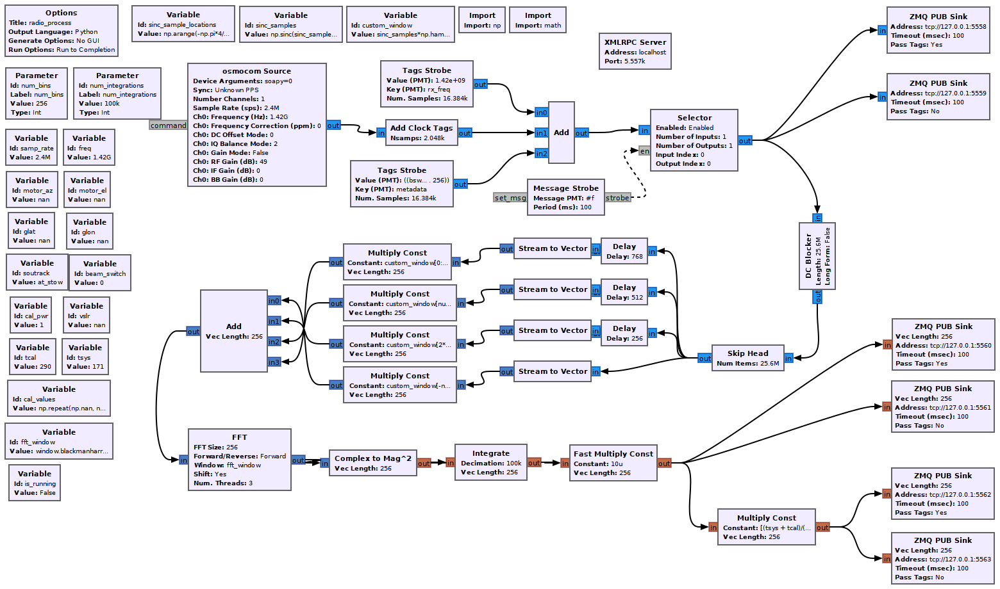
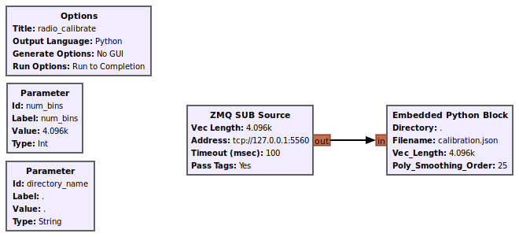
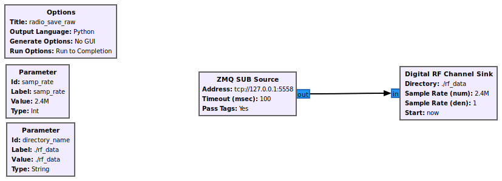
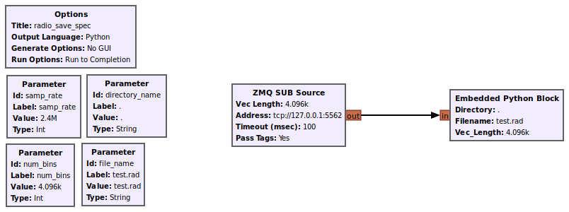
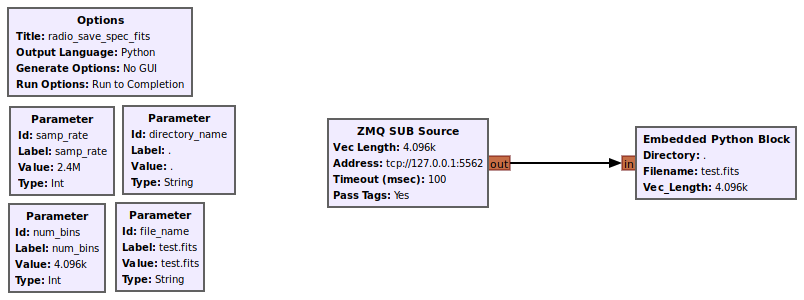

## Small Radio Telescope Docs
#### Radio Processing Details

Since the SRT Software uses GNU Radio for all of its signal processing, there are several scripts which handle different functions.  These scripts, and how they are interconnected, are listed below:

##### Radio Process (radio_process.grc)

Radio Process handles the central portion of the signal processing, taking samples from their source, adding metadata tags to the stream, removing any DC offset, performing a Weighed Overlap Add ([See Here for More Info](https://astropeiler.de/sites/default/files/EUCARA2018_Dwingeloo_goes_SDR.pdf)), taking its FFT, averaging over some number of spectra, and re-scaling each bin based on its calibration value.  Throughout this process, different ZeroMQ Publish blocks are placed to give any number of recipients access to the live data stream at specific points, such as at the raw sample level, the spectra, and the calibrated spectra.  The radio process script also contains a '[XMLRPC](https://wiki.gnuradio.org/index.php/XMLRPC_Server)' block, which allows for other processes to change many of the variables in the script at any time.  The Daemon uses this in order to send new metadata values whenever appropratie (i.e. motor changes position).  The ports used by these are better documented in [port_usage](port_usage.md).

The radio processing script can be automatically started when the daemon starts or have to be run independently, depending on the "RADIO_AUTOSTART" value in the YAML config.  Additionally, this script can be entirely replaced by another GNU Radio script doing an entirely different approach to processing assuming it outputs its data on the same ports and has the same metadata variables.

Note: For SDR sources that have external timing (i.e. GPS), please remove the 'Add Clock Tags' block, since it adds computer clock timing tags as the RTL-SDR used at Haystack does not give any sample timing itself.

##### Radio Calibrate (radio_calibrate.grc)

Radio Calibrate takes data from the tagged uncalibrated spectra stream, and does a high-order polynomial fit to create a smooth calibration curve.  It saves the points from this curve and a scaling value from SDR units to Kelvin into a 'calibration.json' file.  This Daemon only depends on the calibration outputting a JSON, so the source and process for determining calibration values can be completely re-written depending on your circumstances and approach.

##### Radio Save Raw (radio_save_raw.grc)

Radio Save Raw takes tagged raw samples and loads them into a Digital RF Sink block, along with their metadata.

##### Radio Save Spec (radio_save_spec.grc)

Radio Save Spec takes tagged calibrated spectra and stores them in a text file in the .rad format, which is better documented in [save_files](save_files.md).

##### Radio Save Spec FITS (radio_save_spec_fits.grc)

Radio Save Spec FITS takes tagged calibrated spectra and stores them in a binary FITS file using AstroPy, which is better documented in [save_files](save_files.md).

